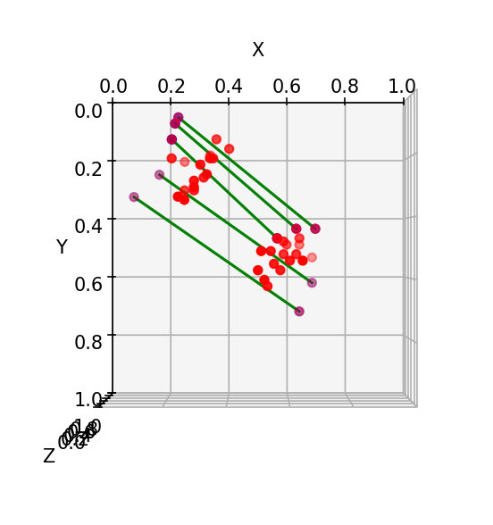

# Steerit - Gesture Controlled Virtual Steering

### Description

Steerit is a real-time gesture control system for driving simulations, using Keras and MediaPipe to convert hand landmarks from camera input into continuous steering and acceleration signals.

### Key Features

* **Real-time Hand Tracking**: The project uses MediaPipe to detect and track both hands in real-time from a live camera feed. It identifies 21 specific 3D landmarks for each hand, which is crucial for gesture analysis.
* **Machine Learning for Steering**: A pre-trained TensorFlow/Keras model is at the core of the steering control. It takes calculated features (like slopes and vectors between hand landmarks) as input and outputs a continuous steering value. This is a non-trivial use of machine learning to translate complex spatial relationships into a meaningful control signal.
* **Integration with External Applications**: The project is designed to act as a "pipe" for control data. It writes the predicted steering and gas values to a file, which allows them to be easily consumed by other programs, such as a C# game or a driving simulator.

---

###  Architecture

#### Record Session

a. `capture_and_record.py` 
is the data capture engine. Its primary function is to record a live video session and save the 3D coordinates of two hands, along with a corresponding steering angle label.
* **Real-time Hand Tracking**: It uses MediaPipe to detect and track up to two hands simultaneously, extracting their 21 3D landmarks for each frame.
* **Data Labeling**: The `detect_ruler_sin_angle` function attempts to automatically label each frame. It uses OpenCV to detect a horizontal line (likely a physical ruler or a reference line in the environment) and calculates the sine of its angle. This provides the ground-truth steering value for each recorded hand pose. This is the "label" for your supervised learning model.
* **Data Storage**: The script stores the raw 3D hand landmark coordinates and their corresponding labels in memory. When the session ends, it saves this data as two separate NumPy files: `landmark_positions.npy` and `label_data.npy`.

b. `featureExtraction.py`
 is the data processing and feature engineering component. It takes the raw 3D landmark data and transforms it into the specific features that will be used to train the machine learning model.
* **Load Raw Data**: It loads the `landmark_positions.npy` file, which contains the raw 3D hand coordinates.
* **Feature Calculation**: It calculates three key types of features:
    1.  **Palm Connection Slopes**: It computes the slope of the lines connecting the palms of the two hands at five key landmark points.
    2.  **Knuckle Slopes**: It calculates the slope of the line connecting the base of the index and pinky fingers (landmarks 5 and 17) for each hand.
    3.  **Y-axis Difference**: It measures the vertical (Y-axis) difference between the base of the two palms (landmark 0).
* **Data Transformation**: It organizes these calculated features into separate NumPy arrays and saves them as `slopes_connection_lines.npy`, `slopes_knuckle_lines.npy`, and `y_diff_array.npy`. This process standardizes the data and makes it ready for the final consolidation step.

c. `Together.py` is the data consolidation and preparation tool. It combines all the processed feature arrays with the labels to create a complete, ready-to-use dataset for model training.

<p align="center">
  
</p>


#### Model Creation & Training

This is the experimentation hub where different neural network architectures are tested and trained. The goal is to find the optimal model for predicting the steering angle from the hand features.

The model is trained on a set of engineered hand geometry features extracted from image data. Each input sample consists of 8 numerical values derived from the following components:

- **Slopes of Connection Lines**, **Slopes of Knuckle Lines**, **Vertical Displacement**, **Target Label** 

These features are designed to be minimal yet expressive, enabling the model to learn meaningful correlations between hand posture and steering intent without relying on raw image data.


#### Gameplay 🎮
The gameplay component is the final stage of the project, where all preceding architectural elements converge to deliver a real-time, interactive experience. This module is responsible for bridging the gap between the hand gesture recognition system and an external application, such as a video game or a driving simulator.

---

### Future Work

To enhance system robustness and driving quality, future developments will focus on integrating classical and modern control techniques. Planned improvements include:


* PID-based control smoothing, ensuring stability and responsiveness under varying gesture patterns
* Kalman filtering for temporal prediction smoothing and reliability during landmark detection gaps
* State observers to infer underlying motion intention from partial or noisy gesture inputs

These enhancements will be evaluated through controlled gesture trials, comparing system responsiveness, prediction accuracy, and user comfort across baseline and improved models.

---
### Prerequisites & Installation

#### Prerequisites

To run this project, you'll need the following software and libraries installed on your system.
* **Python 3.x**
* **OpenCV**
* **MediaPipe**
* **TensorFlow**
* **NumPy**
* **Matplotlib**

---

#### Installation & Usage

1.  **Clone the Repository**

To get started with **Steerit – Gesture Controlled Virtual Steering**, clone the project files from GitHub:

```bash
git clone https://github.com/alerdam/Steerit-Gesture-Controlled-Virtual-Steering.git
cd Steerit-Gesture-Controlled-Virtual-Steering
 ```

2.  **Install Dependencies**: Navigate to the project directory and install all required libraries using `pip`.

    ```bash
    pip install -r requirements.txt
    ```
3.  **Place Model and Library Files**: Ensure that the pre-trained Keras model file, **M_timeaware.keras**, and the **handlib.py** file are located in the project's root directory.
4.  **Run the Project**: To launch the real-time hand tracking and control interface, execute the main Python script from your terminal.
    ```bash
    python gameplay.py
    ```


